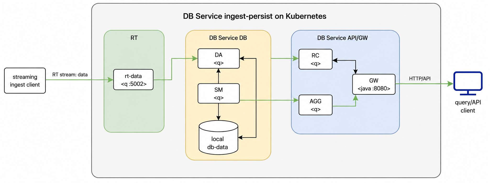

# DB Service Ingest-Persist Reference Architecture

## Description

This reference architecture deploys DB Service on Kubernetes for an ingest-persist pattern. Data can be ingested through RT streaming, persisted by the DB Service database components, and queried through the DB Service gateway. For quick smoke testing, rows can also be imported directly through the DB Service API.

## Architecture

The implementation consists of these local charts:

- `db`, which deploys the DB Service database components that ingest and persist data
- `rt`, which deploys Reliable Transport as the streaming message bus
- `gw`, which deploys the DB Service gateway components used to route queries and API requests



## Running on Kubernetes

### Prerequisites

1. A working Kubernetes cluster with appropriate access to deploy applications
1. `helm`, `kubectl`, and `jq` installed on your local machine
1. A distributed storage solution offering RWM access level. (Kubernetes docs for more [here](https://kubernetes.io/docs/concepts/storage/persistent-volumes/#access-modes))
1. Authentication details to KX image repositories

    ```bash
    KX_USER=....
    KX_PASS=....
    KX_REGISTRY="portal.dl.kx.com"
    NAMESPACE="db-service"
    ```

1. `imagePullSecrets` setup on your cluster

    ```bash
    kubectl create secret docker-registry kx-pull-secret --docker-username=$KX_USER --docker-password=$KX_PASS --docker-server=$KX_REGISTRY -n $NAMESPACE
    ```

1. A license secret
    _Contact KX to get a license_

    ```bash
    LIC_FILE=./kc.lic
    kubectl create secret generic kx-license --from-file=license=$LIC_FILE -n $NAMESPACE
    ```

    To use a `k4.lic`, set `LIC_FILE=./k4.lic` and set `kxLicenseName` to `"k4.lic"` in your values file.

1. A deployment specific values file associated with configurations relative to your deployment. Available configurations are documented in the chart and can be displayed by running

    ```bash
    # Run from `.../referenceArchitectures/helm/ingest-persist` directory
    helm show values .
    ```

    A sample config file is [provided](config/db-service-ingest-persist-values.yaml) but should be reviewed and updated to your configuration.
        - **NOTE:** Please ensure to set the `storageClassName` appropriately.
        - **NOTE:** This reference architecture uses a single HDB storage tier.

### Deploy the chart

The umbrella chart deploys an instance of the `db` DB Service chart and the `rt` RT message bus chart to allow data to be streamed into the database. The naming convention for the RT deployment is related to the `$RELEASENAME` used to deploy the chart: when prefixed with `rt-`, it deploys to `rt-$RELEASENAME`. Configuration for the RT stream is in the sample [config file](config/db-service-ingest-persist-values.yaml). It is critical that the stream name, RT deployment name, and publisher topic are kept in sync to ensure data flows into the database.

The sample values file is configured for the release name `db-service-ip`. If you use a different release name, update `db.stream.name`, `db.dbsDa.rcAddr`, and `gw.dbsSg.smAddrs[0].addr` in your values file before installing or upgrading.

```bash
# Run from '.../referenceArchitectures/helm/ingest-persist/' directory
helm dependency build

RELEASENAME=db-service-ip # Matches the sample values file
VALUESFILE=./config/db-service-ingest-persist-values.yaml
NAMESPACE="db-service"
helm install $RELEASENAME . -f $VALUESFILE -n $NAMESPACE
```

At this point the reference architecture has been successfully deployed. The next step is to [create a table and choose an ingest path](#create-a-table-and-choose-an-ingest-path).

#### Update configuration

Upgrading and updating of configuration is executed using `helm upgrade`. This will deploy any changes made to the charts or configuration since the last deploy and automatically redeploy the latest to the application.

```bash
helm upgrade $RELEASENAME . -f $VALUESFILE -n $NAMESPACE
```

### Ingest data

By default, DB Service reference architectures on Kubernetes do not expose external endpoints to the application and port forwarding is used. External access can be provided through the DB Service gateway. To enable external access, add the following configuration to the [config](config/db-service-ingest-persist-values.yaml):

```yaml
...
gw:
  dbsSg:
    service:
      type: LoadBalancer
      # type: NodePort
...
```

#### Create a table and choose an ingest path

Create the target table through the DB Service API before importing or streaming data.

Depending on whether you have enabled external access to the gateway, the URL used to access the gateway can be defined as follows:

- With external access points enabled using a `LoadBalancer`, the `$GW_URL` is set as follows:

    ```bash
    # Get the GW LoadBalancer URL
    LB_HOST=`kubectl get svc $RELEASENAME-gw-sg -o jsonpath='{.status.loadBalancer.ingress[0].hostname}' -n $NAMESPACE`
    GW_URL="$LB_HOST:8080"
    ```

- Without external access, the `gw` service requires port forwarding to access the gateway:

    ```bash
    kubectl port-forward svc/$RELEASENAME-gw-sg 8080:8080 -n $NAMESPACE &
    GW_URL="localhost:8080"
    ```

Create the table:

```bash
curl -s -X POST "http://$GW_URL/api/v0/tables/fxquote" \
  -H "Accept: application/json" \
  -H "Content-Type: application/json" \
  -d '{
    "type": "partitioned",
    "prtnCol": "ts",
    "columns": [
      {"name": "trddate", "type": "date"},
      {"name": "ts", "type": "timestamp"},
      {"name": "sym", "type": "symbol"},
      {"name": "bid", "type": "float"},
      {"name": "ask", "type": "float"}
    ]
  }' | jq
```

Once the table is created, you can ingest data using one of the following two methods:


##### Option 1: Import rows through the DB Service API

```bash
curl -s -X POST "http://$GW_URL/api/v0/imports/data" \
  -H "Accept: application/json" \
  -H "Content-Type: application/json" \
  -d '{
    "table": "fxquote",
    "data": [
      ["2026-01-21", "2026-01-21T10:00:00.000", "EURUSD", 1.16035, 1.16085],
      ["2026-01-21", "2026-01-21T10:00:01.000", "GBPUSD", 1.34040, 1.34120],
      ["2026-01-21", "2026-01-21T10:00:02.000", "USDJPY", 157.975, 158.025]
    ],
    "columnNames": ["trddate", "ts", "sym", "bid", "ask"]
  }' | jq


# The import response includes a job identifier. Use that identifier to check the import status:
curl -s "http://$GW_URL/api/v0/imports/<job-id>" | jq
```


##### Option 2: Stream rows through RT

Use RT streaming when you want to test the reference architecture's normal ingest-persist data path. Follow the DB Service [streaming ingest guide](https://code.kx.com/kdb-x/services/db-service/import.html#streaming-ingest), using the RT `data` topic for inserts.

If the RT service is not exposed externally, port-forward the first RT service before running your feed:

```bash
kubectl port-forward svc/rt-$RELEASENAME-0 5002:5002 -n $NAMESPACE &
```

Once rows have been streamed, they can be [queried](#querying-data).

### Querying data

Depending on whether you have enabled external access to the gateway, set `$GW_URL` as shown in the [create table section](#create-a-table-and-choose-an-ingest-path).

Now that `$GW_URL` is configured, query data through the DB Service gateway:

```bash
curl -s -X POST "http://$GW_URL/api/v0/query/simple" \
  -H "Accept: application/json" \
  -H "Content-Type: application/json" \
  -d '{
    "table": "fxquote",
    "limit": 2
  }' | jq
```

## Cleaning up

The `db-service-ingest-persist` reference architecture deployment can be deleted with helm as follows:

```bash
helm delete $RELEASENAME -n $NAMESPACE
```

By default the policy is to not delete associated volumes to allow it to be redeployed in the future and retain the data. If necessary these should be manually managed and deleted by the user.

## Requirements

| Repository | Name | Version |
|------------|------|---------|
| file://../../kxCharts/gw | gw | 0.1.0 |
| file://../../kxCharts/db | db | 0.1.0 |
| file://../../kxCharts/rt | rt | 1.18.1 |

## Configuration Options

### Subchart configuration

Configuration for subcharts of `db-service-ingest-persist`.

See the chart READMEs under `referenceArchitectures/kxCharts/` for the full local configuration tables:

- [gw](../../kxCharts/gw/README.md)
- [db](../../kxCharts/db/README.md)
- [rt](../../kxCharts/rt/README.md)
