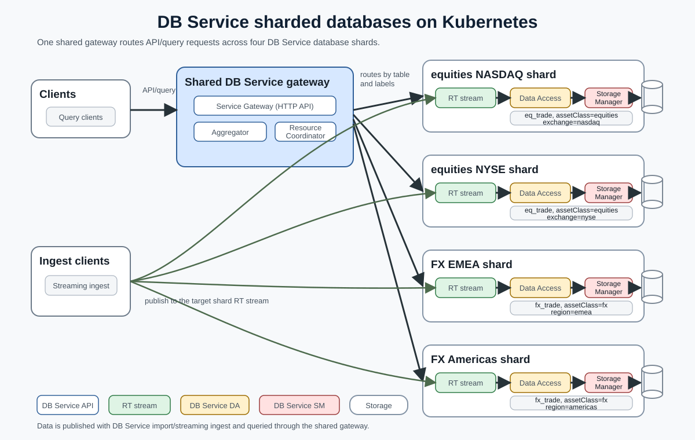

# DB Service Sharded Databases Reference Architecture

## Overview

This reference architecture deploys DB Service on Kubernetes as a multi-database, multi-shard application. It uses one shared DB Service gateway and four database shard deployments.

The example models two finance domains: equities trades split by exchange, and FX trades split by region. Import requests use assembly names to select a shard, while query requests use labels to select one or more shards.

## Contents

- [Architecture](#architecture)
- [Configuration files](#configuration-files)
- [Prepare the environment](#prepare-the-environment)
- [Deploy DB Service](#deploy-db-service)
- [Port-forward the gateway](#port-forward-the-gateway)
- [Import data](#import-data)
- [Query data](#query-data)
- [Upgrade the deployment](#upgrade-the-deployment)
- [Clean up](#clean-up)

## Architecture

The implementation uses two umbrella charts:

- `db-service-api`: A common gateway umbrella chart comprising the base `gw` chart under `../../kxCharts`.
- `db-service-db-shard`: An instance of a DB Service database shard comprising the `db` and `rt` charts under `../../kxCharts`.



### Shard routing

An assembly file defines a database's tables and related configuration. Each deployed shard has its own assembly name, configured through `db.assembly.name`, which import requests use as a routing identifier. Query requests use the shard's labels.

| Shard | Assembly name | Query labels | Table |
|---|---|---|---|
| Equities / NASDAQ | `equities_nasdaq` | `assetClass=equities`, `exchange=nasdaq` | `eq_trade` |
| Equities / NYSE | `equities_nyse` | `assetClass=equities`, `exchange=nyse` | `eq_trade` |
| FX / EMEA | `fx_emea` | `assetClass=fx`, `region=emea` | `fx_trade` |
| FX / Americas | `fx_americas` | `assetClass=fx`, `region=americas` | `fx_trade` |

To query both shards in a database, specify only its `assetClass` label:

- `assetClass=equities` targets both equities shards.
- `assetClass=fx` targets both FX shards.

## Configuration files

This example separates database definitions from deployment settings.

### Assembly files

| File | Purpose |
|---|---|
| `config/db-service-db-equities-assembly.yaml` | Defines the `eq_trade` table, its columns, and the query-label structure used by the equities shards. |
| `config/db-service-db-fx-assembly.yaml` | Defines the `fx_trade` table, its columns, and the query-label structure used by the FX shards. |

### Helm values files

| File | Purpose |
|---|---|
| `config/db-service-api-values.yaml` | Configures the shared gateway. `gw.dbsSg.smAddrs` maps each assembly name to the Storage Manager address of its shard, for example `equities_nasdaq -> db-service-db-equities-nasdaq-db-sm:20001`. |
| `config/db-service-db-shard-values.yaml` | Defines settings shared by all database shards, including persistent storage, imports, licensing, and common DA/SM settings. |
| `config/db-service-db-equities-nasdaq-values.yaml` | Sets the NASDAQ equities shard's assembly name, RT stream, and query-label values. |
| `config/db-service-db-equities-nyse-values.yaml` | Sets the NYSE equities shard's assembly name, RT stream, and query-label values. |
| `config/db-service-db-fx-emea-values.yaml` | Sets the EMEA FX shard's assembly name, RT stream, and query-label values. |
| `config/db-service-db-fx-americas-values.yaml` | Sets the Americas FX shard's assembly name, RT stream, and query-label values. |

## Prepare the environment

Run these commands from the `referenceArchitectures/helm/sharded-databases` directory.

### Prerequisites

- A working Kubernetes cluster with permission to deploy applications.
- `helm`, `kubectl`, and `jq` installed locally.
- Distributed storage that supports the ReadWriteMany (`RWX`) access mode. See [Kubernetes persistent-volume access modes](https://kubernetes.io/docs/concepts/storage/persistent-volumes/#access-modes).
- Authentication details for the KX image repositories.

```bash
# Set environment variables
KX_USER=....
KX_PASS=....
KX_REGISTRY="portal.dl.kx.com"
NAMESPACE="db-service"
LIC_FILE="./k4.lic"

# Create the namespace
kubectl create namespace "$NAMESPACE" --dry-run=client -o yaml | kubectl apply -f -

# Create the image pull secret
kubectl create secret docker-registry kx-pull-secret \
  --docker-username="$KX_USER" \
  --docker-password="$KX_PASS" \
  --docker-server="$KX_REGISTRY" \
  -n "$NAMESPACE"

# Create the license secret
kubectl create secret generic kx-license \
  --from-file=license="$LIC_FILE" \
  -n "$NAMESPACE"
```

## Deploy DB Service

### Set deployment variables

The upgrade and cleanup commands later in this README reuse these variables.

```bash
RELEASENAME_API="db-service-api"
RELEASENAME_EQUITIES_NASDAQ="db-service-db-equities-nasdaq"
RELEASENAME_EQUITIES_NYSE="db-service-db-equities-nyse"
RELEASENAME_FX_EMEA="db-service-db-fx-emea"
RELEASENAME_FX_AMERICAS="db-service-db-fx-americas"

VALUESFILE_API="./config/db-service-api-values.yaml"
VALUESFILE_COMMON="./config/db-service-db-shard-values.yaml"
VALUESFILE_EQUITIES_NASDAQ="./config/db-service-db-equities-nasdaq-values.yaml"
VALUESFILE_EQUITIES_NYSE="./config/db-service-db-equities-nyse-values.yaml"
VALUESFILE_FX_EMEA="./config/db-service-db-fx-emea-values.yaml"
VALUESFILE_FX_AMERICAS="./config/db-service-db-fx-americas-values.yaml"
```

### Prepare the Helm charts

Copy the assembly files into the local DB Service `db` chart, then build the chart dependencies:

```bash
cp ./config/db-service-db-equities-assembly.yaml ../../kxCharts/db/
cp ./config/db-service-db-fx-assembly.yaml ../../kxCharts/db/

helm dependency build ./db-service-api
helm dependency build ./db-service-db-shard
```

### Deploy the shared gateway

Review and update [db-service-api-values.yaml](config/db-service-api-values.yaml) before deployment. The `gw.dbsSg.smAddrs` entries must match the Storage Manager service names of the shard releases.

```bash
helm install "$RELEASENAME_API" ./db-service-api \
  -f "$VALUESFILE_API" \
  -n "$NAMESPACE"
```

### Deploy the equities shards

```bash
helm install "$RELEASENAME_EQUITIES_NASDAQ" ./db-service-db-shard \
  -f "$VALUESFILE_COMMON" \
  -f "$VALUESFILE_EQUITIES_NASDAQ" \
  -n "$NAMESPACE"

helm install "$RELEASENAME_EQUITIES_NYSE" ./db-service-db-shard \
  -f "$VALUESFILE_COMMON" \
  -f "$VALUESFILE_EQUITIES_NYSE" \
  -n "$NAMESPACE"
```

### Deploy the FX shards

```bash
helm install "$RELEASENAME_FX_EMEA" ./db-service-db-shard \
  -f "$VALUESFILE_COMMON" \
  -f "$VALUESFILE_FX_EMEA" \
  -n "$NAMESPACE"

helm install "$RELEASENAME_FX_AMERICAS" ./db-service-db-shard \
  -f "$VALUESFILE_COMMON" \
  -f "$VALUESFILE_FX_AMERICAS" \
  -n "$NAMESPACE"
```

## Port-forward the gateway

```bash
# Expose the shared DB Service gateway HTTP endpoint from your local shell.
kubectl port-forward "svc/${RELEASENAME_API}-gw-sg" 8080:8080 -n "$NAMESPACE" &
GW_URL="http://localhost:8080"
```

## Import data

Import API calls use the assembly names in the [shard-routing table](#shard-routing) to select a target shard.

| Assembly name | Sample file |
|---|---|
| `equities_nasdaq` | `samples/eq-trade-nasdaq.csv` |
| `equities_nyse` | `samples/eq-trade-nyse.csv` |
| `fx_emea` | `samples/fx-trade-emea.csv` |
| `fx_americas` | `samples/fx-trade-americas.csv` |

The shard assembly files already define the tables, so these imports load CSV data into existing tables. Each example first copies a bundled sample CSV into the matching shard's `/imports` directory.

### Import into the equities shards

<details>
<summary>Import into <code>equities_nasdaq</code></summary>

```bash
# Copy the sample CSV into this shard's import directory.
kubectl cp ./samples/eq-trade-nasdaq.csv \
  "${NAMESPACE}/${RELEASENAME_EQUITIES_NASDAQ}-db-sm-0:/imports/eq-trade-nasdaq.csv" \
  -c sm

# Import the staged CSV into the table defined by the assembly.
EQ_TRADE_NASDAQ_JOB_ID=$(curl -s -X POST "$GW_URL/api/v0/imports/files?assembly=equities_nasdaq" \
  -H "Accept: application/json" \
  -H "Content-Type: application/json" \
  -d '{
    "table": "eq_trade",
    "path": "eq-trade-nasdaq.csv",
    "format": "csv",
    "delimiter": ",",
    "headerRowIndex": 0,
    "types": "PSSFJG"
  }' | jq -r '.jobId')

# Check the import status.
curl -s "$GW_URL/api/v0/imports/$EQ_TRADE_NASDAQ_JOB_ID?assembly=equities_nasdaq" \
  -H "Accept: application/json" | jq
```

</details>

<details>
<summary>Import into <code>equities_nyse</code></summary>

```bash
# Copy the sample CSV into this shard's import directory.
kubectl cp ./samples/eq-trade-nyse.csv \
  "${NAMESPACE}/${RELEASENAME_EQUITIES_NYSE}-db-sm-0:/imports/eq-trade-nyse.csv" \
  -c sm

# Import the staged CSV into the table defined by the assembly.
EQ_TRADE_NYSE_JOB_ID=$(curl -s -X POST "$GW_URL/api/v0/imports/files?assembly=equities_nyse" \
  -H "Accept: application/json" \
  -H "Content-Type: application/json" \
  -d '{
    "table": "eq_trade",
    "path": "eq-trade-nyse.csv",
    "format": "csv",
    "delimiter": ",",
    "headerRowIndex": 0,
    "types": "PSSFJG"
  }' | jq -r '.jobId')

# Check the import status.
curl -s "$GW_URL/api/v0/imports/$EQ_TRADE_NYSE_JOB_ID?assembly=equities_nyse" \
  -H "Accept: application/json" | jq
```

</details>

### Import into the FX shards

<details>
<summary>Import into <code>fx_emea</code></summary>

```bash
# Copy the sample CSV into this shard's import directory.
kubectl cp ./samples/fx-trade-emea.csv \
  "${NAMESPACE}/${RELEASENAME_FX_EMEA}-db-sm-0:/imports/fx-trade-emea.csv" \
  -c sm

# Import the staged CSV into the table defined by the assembly.
FX_TRADE_EMEA_JOB_ID=$(curl -s -X POST "$GW_URL/api/v0/imports/files?assembly=fx_emea" \
  -H "Accept: application/json" \
  -H "Content-Type: application/json" \
  -d '{
    "table": "fx_trade",
    "path": "fx-trade-emea.csv",
    "format": "csv",
    "delimiter": ",",
    "headerRowIndex": 0,
    "types": "PSSFFSG"
  }' | jq -r '.jobId')

# Check the import status.
curl -s "$GW_URL/api/v0/imports/$FX_TRADE_EMEA_JOB_ID?assembly=fx_emea" \
  -H "Accept: application/json" | jq
```

</details>

<details>
<summary>Import into <code>fx_americas</code></summary>

```bash
# Copy the sample CSV into this shard's import directory.
kubectl cp ./samples/fx-trade-americas.csv \
  "${NAMESPACE}/${RELEASENAME_FX_AMERICAS}-db-sm-0:/imports/fx-trade-americas.csv" \
  -c sm

# Import the staged CSV into the table defined by the assembly.
FX_TRADE_AMERICAS_JOB_ID=$(curl -s -X POST "$GW_URL/api/v0/imports/files?assembly=fx_americas" \
  -H "Accept: application/json" \
  -H "Content-Type: application/json" \
  -d '{
    "table": "fx_trade",
    "path": "fx-trade-americas.csv",
    "format": "csv",
    "delimiter": ",",
    "headerRowIndex": 0,
    "types": "PSSFFSG"
  }' | jq -r '.jobId')

# Check the import status.
curl -s "$GW_URL/api/v0/imports/$FX_TRADE_AMERICAS_JOB_ID?assembly=fx_americas" \
  -H "Accept: application/json" | jq
```

</details>

### Streaming data

For streaming ingest, follow the DB Service [streaming ingest guide](https://code.kx.com/kdb-x/services/db-service/import.html#streaming-ingest). Each shard has its own RT stream.

If the RT service is not exposed externally, port-forward the shard you want to publish to:

```bash
kubectl port-forward "svc/rt-${RELEASENAME_EQUITIES_NASDAQ}-0" 5002:5002 -n "$NAMESPACE" &
```

## Query data

Query calls use the labels in the [shard-routing table](#shard-routing) to select one shard or both shards in a database.

The sample CSVs use fixed timestamps, so the query ranges below match the sample data.

### Query the equities database

```bash
# Query the NASDAQ equities shard.
curl -s -X POST "$GW_URL/api/v0/query/simple" \
  -H "Accept: application/json" \
  -H "Content-Type: application/json" \
  -d '{
    "table": "eq_trade",
    "startTS": "2026.01.21D10:00:00.000000000",
    "endTS": "2026.01.21D10:00:02.000000000",
    "labels": {
      "assetClass": "equities",
      "exchange": "nasdaq"
    },
    "limit": 5
  }' | jq

# Query the NYSE equities shard.
curl -s -X POST "$GW_URL/api/v0/query/simple" \
  -H "Accept: application/json" \
  -H "Content-Type: application/json" \
  -d '{
    "table": "eq_trade",
    "startTS": "2026.01.21D10:00:02.000000000",
    "endTS": "2026.01.21D10:00:04.000000000",
    "labels": {
      "assetClass": "equities",
      "exchange": "nyse"
    },
    "limit": 5
  }' | jq

# Query both equities shards. Run both equities imports first to return rows from both shards.
curl -s -X POST "$GW_URL/api/v0/query/simple" \
  -H "Accept: application/json" \
  -H "Content-Type: application/json" \
  -d '{
    "table": "eq_trade",
    "startTS": "2026.01.21D10:00:00.000000000",
    "endTS": "2026.01.21D10:00:04.000000000",
    "labels": {
      "assetClass": "equities"
    },
    "limit": 5
  }' | jq
```

### Query the FX database

```bash
# Query the EMEA FX shard.
curl -s -X POST "$GW_URL/api/v0/query/simple" \
  -H "Accept: application/json" \
  -H "Content-Type: application/json" \
  -d '{
    "table": "fx_trade",
    "startTS": "2026.01.21D10:00:00.000000000",
    "endTS": "2026.01.21D10:00:02.000000000",
    "labels": {
      "assetClass": "fx",
      "region": "emea"
    },
    "limit": 5
  }' | jq

# Query the Americas FX shard.
curl -s -X POST "$GW_URL/api/v0/query/simple" \
  -H "Accept: application/json" \
  -H "Content-Type: application/json" \
  -d '{
    "table": "fx_trade",
    "startTS": "2026.01.21D10:00:02.000000000",
    "endTS": "2026.01.21D10:00:04.000000000",
    "labels": {
      "assetClass": "fx",
      "region": "americas"
    },
    "limit": 5
  }' | jq

# Query both FX shards. Run both FX imports first to return rows from both shards.
curl -s -X POST "$GW_URL/api/v0/query/simple" \
  -H "Accept: application/json" \
  -H "Content-Type: application/json" \
  -d '{
    "table": "fx_trade",
    "startTS": "2026.01.21D10:00:00.000000000",
    "endTS": "2026.01.21D10:00:04.000000000",
    "labels": {
      "assetClass": "fx"
    },
    "limit": 5
  }' | jq
```

## Upgrade the deployment

Use `helm upgrade` with the same values files used during installation.

```bash
helm upgrade "$RELEASENAME_API" ./db-service-api \
  -f "$VALUESFILE_API" \
  -n "$NAMESPACE"

helm upgrade "$RELEASENAME_EQUITIES_NASDAQ" ./db-service-db-shard \
  -f "$VALUESFILE_COMMON" \
  -f "$VALUESFILE_EQUITIES_NASDAQ" \
  -n "$NAMESPACE"

helm upgrade "$RELEASENAME_EQUITIES_NYSE" ./db-service-db-shard \
  -f "$VALUESFILE_COMMON" \
  -f "$VALUESFILE_EQUITIES_NYSE" \
  -n "$NAMESPACE"

helm upgrade "$RELEASENAME_FX_EMEA" ./db-service-db-shard \
  -f "$VALUESFILE_COMMON" \
  -f "$VALUESFILE_FX_EMEA" \
  -n "$NAMESPACE"

helm upgrade "$RELEASENAME_FX_AMERICAS" ./db-service-db-shard \
  -f "$VALUESFILE_COMMON" \
  -f "$VALUESFILE_FX_AMERICAS" \
  -n "$NAMESPACE"
```

## Clean up

Delete the deployed Helm releases:

```bash
helm delete "$RELEASENAME_API" -n "$NAMESPACE"
helm delete "$RELEASENAME_EQUITIES_NASDAQ" -n "$NAMESPACE"
helm delete "$RELEASENAME_EQUITIES_NYSE" -n "$NAMESPACE"
helm delete "$RELEASENAME_FX_EMEA" -n "$NAMESPACE"
helm delete "$RELEASENAME_FX_AMERICAS" -n "$NAMESPACE"
```

If you created the import PVCs, delete them when they are no longer needed:

```bash
kubectl delete pvc db-service-db-equities-nasdaq-imports -n "$NAMESPACE"
kubectl delete pvc db-service-db-equities-nyse-imports -n "$NAMESPACE"
kubectl delete pvc db-service-db-fx-emea-imports -n "$NAMESPACE"
kubectl delete pvc db-service-db-fx-americas-imports -n "$NAMESPACE"
```

Deleting the Helm releases does not delete the associated volumes by default, allowing data to persist across redeployments. Delete retained volumes manually when they are no longer required.
