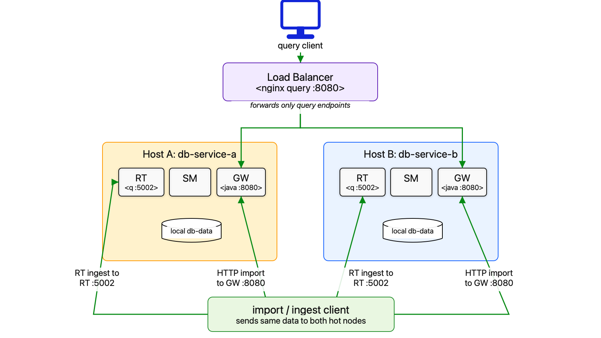

# Single-Node Hot/Hot Reference Architecture

## Description

This reference architecture runs two independent single-node DB Service deployments in an active/active (hot/hot) configuration. Each deployment runs on a separate host, and an HTTP load balancer distributes query traffic across both DB Service gateways.

Data is not replicated automatically between the two deployments. Import and RT ingest clients must send the same data to both DB Service hosts so that either host can serve the same queries.

Because writes are sent independently to each deployment, this architecture does not provide atomic replication between hosts. Clients must handle partial failures and ensure that the two deployments remain synchronized.

Each host runs one normal single-node DB Service stack using the root DB Service [docker-compose.yaml](../../docker-compose.yaml). The two hosts must have independent data directories.

## Contents

- [Architecture](#architecture)
- [Running with Docker Compose](#running-with-docker-compose)
- [Configuration changes](#configuration-changes)
- [Testing](#testing)
- [Cleaning up](#cleaning-up)

## Architecture

The architecture consists of two DB Service hosts and a load-balancing layer:

- Host A runs one DB Service single-node deployment.
- Host B runs one DB Service single-node deployment.
- The load-balancing layer forwards HTTP query traffic to the DB Service gateway on Host A or Host B.

Import and ingest clients send the same data directly to both DB Service hosts.

This example runs nginx on a third host as the load balancer. The nginx host is itself a single point of failure and is intended as a simple reference implementation. For production deployments, use a highly available or managed HTTP-capable load balancer or reverse proxy, such as AWS ALB, HAProxy, Envoy, or an equivalent platform service.



## Running with Docker Compose

### Prerequisites

1. Two hosts with Docker and Docker Compose installed
1. A third host, or an existing load-balancing layer, for routing HTTP query traffic
1. Authentication details to KX image repositories, if required by the DB Service images
1. DB Service license configuration available to the Docker Compose environment
1. Network access from the load balancer to both DB Service HTTP gateway endpoints
1. Network access from import and ingest clients to both DB Service hosts

### Deploying DB Service on each host

On each of the two hosts, Host A and Host B, run the same DB Service stack from the root of the DB Service repo:

```bash
./init-db.sh
docker compose up -d
```

By default, each host exposes:

```text
HTTP gateway: 8080
RT ingest:    5002
```

### Deploying the load balancer

On the load balancer host, create or update `referenceArchitectures/single-node-hot-hot/.env`:

```text
DB_SERVICE_A_GATEWAY=host-a.example.com:8080
DB_SERVICE_B_GATEWAY=host-b.example.com:8080

# Optional. Defaults to 8080 if not set.
DS_LB_HTTP_PORT=8080
```

Replace `host-a.example.com` and `host-b.example.com` with real hostnames or IP addresses.

Start the load balancer:

```bash
docker compose -f docker-compose.load-balancer.yaml up -d
```

After deployment, the next step is [accessing the deployment](#accessing-the-deployment).

### Accessing the deployment

Query clients connect to the load balancer rather than directly to either DB Service host:

```text
http://load-balancer-host:8080
```

Python, q, and cURL clients use the same DB Service APIs as normal; only the HTTP base URL changes for load-balanced query traffic.

### Import and ingest data

Do not import through the load balancer. A normal load balancer sends a request to one backend, but hot/hot data must be present on both DB Service hosts.

Send import or RT ingest to both DB Service hosts:

```text
Host A HTTP import: http://host-a.example.com:8080
Host B HTTP import: http://host-b.example.com:8080

Host A RT ingest: host-a.example.com:5002
Host B RT ingest: host-b.example.com:5002
```

Create the table on both DB Service hosts:

```bash
for host in host-a.example.com host-b.example.com; do
  curl -s -X POST "http://${host}:8080/api/v0/tables/fxquote" \
    -H "Accept: application/json" \
    -H "Content-Type: application/json" \
    -d '{
      "type": "partitioned",
      "prtnCol": "ts",
      "columns": [
        {"name": "trddate", "type": "date"},
        {"name": "ts", "type": "timestamp"},
        {"name": "sym", "type": "symbol"},
        {"name": "bid", "type": "float"},
        {"name": "ask", "type": "float"}
      ]
    }'
done
```

Import the same rows into both DB Service hosts:

```bash
for host in host-a.example.com host-b.example.com; do
  curl -s -X POST "http://${host}:8080/api/v0/imports/data" \
    -H "Accept: application/json" \
    -H "Content-Type: application/json" \
    -d '{
      "table": "fxquote",
      "data": [
        ["2026-01-21", "2026-01-21T10:00:00.000", "EURUSD", 901.2, 901.3],
        ["2026-01-21", "2026-01-21T10:00:01.000", "GBPUSD", 801.2, 801.3]
      ],
      "columnNames": ["trddate", "ts", "sym", "bid", "ask"],
      "insert_as": "rows"
    }'
done
```

Each import request returns its own job ID. Check each import job on the direct host that accepted it:

```bash
curl -s "http://host-a.example.com:8080/api/v0/imports/{HOST_A_JOB_ID}"
curl -s "http://host-b.example.com:8080/api/v0/imports/{HOST_B_JOB_ID}"
```

### Query data

Query clients should use the load balancer:

```bash
curl -s -X POST "http://load-balancer-host:8080/api/v0/query/sql" \
  -H "Accept: application/json" \
  -H "Content-Type: application/json" \
  -d '{"query": "SELECT * FROM fxquote"}'
```

The load balancer only exposes these DB Service query endpoints:

- `/api/v0/query/simple`
- `/api/v0/query/sql`
- `/api/v0/query/q`

## Configuration changes

Configuration changes to each DB Service host are made through the root DB Service [docker-compose.yaml](../../docker-compose.yaml) and `.env` file on that host.

After changing Host A or Host B configuration, restart the relevant DB Service stack from the root of the DB Service repo:

```bash
docker compose up -d
```

Configuration changes to load-balancer routing are made by updating `DB_SERVICE_A_GATEWAY`, `DB_SERVICE_B_GATEWAY`, or `DS_LB_HTTP_PORT` in the load balancer `.env` file, or by changing [nginx.conf](nginx.conf). Then restart the load balancer:

```bash
docker compose -f docker-compose.load-balancer.yaml up -d
```

## Testing

After deploying Host A, Host B, and the load balancer, use these checks to confirm that both DB Service hosts contain the expected data.

Check that each direct DB Service host can see the table:

```bash
curl -s "http://host-a.example.com:8080/api/v0/tables"
curl -s "http://host-b.example.com:8080/api/v0/tables"
```

Query each DB Service host directly and confirm that both return the same data:

```bash
curl -s -X POST "http://host-a.example.com:8080/api/v0/query/sql" \
  -H "Accept: application/json" \
  -H "Content-Type: application/json" \
  -d '{"query": "SELECT * FROM fxquote"}'

curl -s -X POST "http://host-b.example.com:8080/api/v0/query/sql" \
  -H "Accept: application/json" \
  -H "Content-Type: application/json" \
  -d '{"query": "SELECT * FROM fxquote"}'
```

Query the imported data through the load balancer:

```bash
curl -s -X POST "http://load-balancer-host:8080/api/v0/query/sql" \
  -H "Accept: application/json" \
  -H "Content-Type: application/json" \
  -d '{"query": "SELECT * FROM fxquote"}'
```

Confirm non-query endpoints are rejected by the load balancer:

```bash
curl -s "http://load-balancer-host:8080/api/v0/tables"
```

## Cleaning up

On each DB Service host, from the root of the DB Service repo:

```bash
docker compose down
```

On the load balancer host, from this directory:

```bash
docker compose -f docker-compose.load-balancer.yaml down
```
